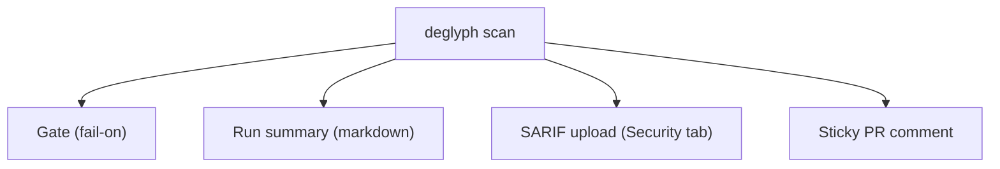

# The GitHub Action

`deglyph` ships a composite GitHub Action that wraps `deglyph scan`. From one scan
it produces up to four result surfaces: a job gate, a run summary, code-scanning
alerts in the Security tab, and a sticky pull-request comment.

## Minimal usage

```yaml
- uses: deglyph-re/cli@v1
  with:
    path: build/app.exe
```

This runs the gating scan with the default `--fail-on warning` and writes the
markdown report to the Actions run summary.

## Full example

```yaml
permissions:
  contents: read
  security-events: write   # upload-sarif -> Security tab
  pull-requests: write     # comment -> sticky PR comment

jobs:
  scan:
    runs-on: ubuntu-latest
    steps:
      - uses: actions/checkout@v4
      - uses: deglyph-re/cli@v1
        with:
          path: build/app.exe
          fail-on: warning
          upload-sarif: "true"
          comment: "true"
          ignore-file: .deglyphignore
```

## Result surfaces



- **Gate.** The primary step runs `deglyph scan --fail-on <input>` and fails the
  job when the worst finding meets the threshold.
- **Run summary.** On every run (push and pull request), the markdown report is
  appended to the Actions run page. Controlled by the `summary` input, on by
  default.
- **SARIF upload.** With `upload-sarif: "true"`, findings are published to code
  scanning and appear as alerts in the Security tab. Requires the job to grant
  `security-events: write`.
- **Sticky PR comment.** With `comment: "true"` on a pull request, the report is
  posted as a comment and updated in place on later pushes, rather than stacking
  a new comment each time. Requires `pull-requests: write`.

The summary, upload, and comment steps always run even when the gate fails, so a
failing build still produces its report.

## Inputs

| Input | Default | Description |
| --- | --- | --- |
| `path` | (required) | Binary or directory to scan |
| `fail-on` | `warning` | `note` / `warning` / `error` / `never` |
| `summary` | `true` | Write the markdown report to the run summary |
| `badge` | (none) | Write a shields.io endpoint JSON to this path for a live badge |
| `upload-sarif` | `false` | Upload SARIF to code scanning |
| `comment` | `false` | Post a sticky PR comment |
| `baseline` | (none) | A prior build to diff against |
| `cve` | `false` | Query osv.dev for CVEs (network) |
| `entropy` | `false` | Also flag high-entropy blobs |
| `no-hardening` | `false` | Skip the hardening check |
| `no-fingerprint` | `false` | Skip library fingerprinting |
| `ignore` | (none) | Suppress rules (comma/space separated) |
| `ignore-file` | (none) | Path to a `.deglyphignore` file |

A ready-to-copy workflow lives at `examples/deglyph-scan.yml` in the repository.

## See also

- [Scanning Binaries](Scanning.md): the underlying command.
- [Output Formats](Output-Formats.md): the SARIF and markdown reports.
- [Suppressing Findings](Suppressing-Findings.md): the `ignore` inputs.
- [Badges](Badges.md): the `badge` input as a live README badge.
