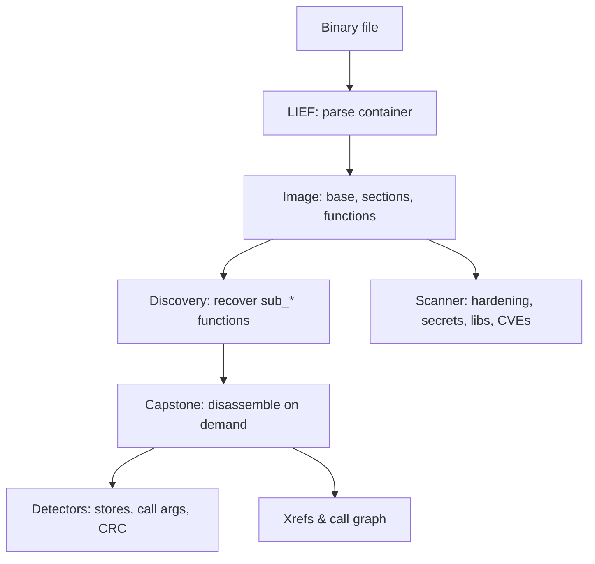

# How deglyph Works

`deglyph` turns a binary file into a navigable model in a fixed pipeline. Each
stage is read-only; the binary is never executed.

## The pipeline

## Stage 1: parse the container

The LIEF library parses PE, ELF, and Mach-O containers (including fat binaries).
`deglyph` projects the result into a uniform `Image`: the base address, the list of
sections, and the functions named in the export and symbol tables. Everything
downstream works in virtual addresses with the base already applied.

## Stage 2: discover functions

A stripped release build names almost nothing. `deglyph` scans the executable
sections for direct call targets and adds the functions it finds as `sub_<va>`
entries, so the tree, cross-references, and the call graph are populated. See
[Function Discovery](Function-Discovery.md).

## Stage 3: disassemble on demand

The Capstone engine disassembles a function when you view it, in the mode the
detected architecture selects. Disassembly is never done for the whole image up
front; it is computed per function and the view is windowed for large functions.

## Stage 4: recover structure

Two kinds of analysis run on top of the disassembly:

- **Cross-references** resolve wrapper chains, callers, and callees, and build a
  bounded call graph.
- **Pattern detectors** recover constants written to memory, constant call
  arguments, and CRC loops. See [Pattern Detectors](Pattern-Detectors.md).

These are heuristics that point at instructions; they do not prove behavior. See
[Heuristics, Not Proofs](Heuristics.md).

## The scanner path

`deglyph scan` uses the same `Image` but a different consumer: instead of an
interactive view, it runs static detectors for hardening posture, secrets,
imports, library fingerprints, CVEs, and baseline drift, and emits a findings
report. See [Scanning Binaries](Scanning.md).

## The stack

`deglyph` is built on LIEF for container parsing, Capstone for disassembly, and
Textual with Rich for the terminal interface. It is written in Python 3.10+ and
licensed under the GPLv3.

## See also

- [Loading Binaries](Loading-Binaries.md): formats and the address model.
- [Function Discovery](Function-Discovery.md): the recovery pass.
- [Heuristics, Not Proofs](Heuristics.md): the contract on every result.
