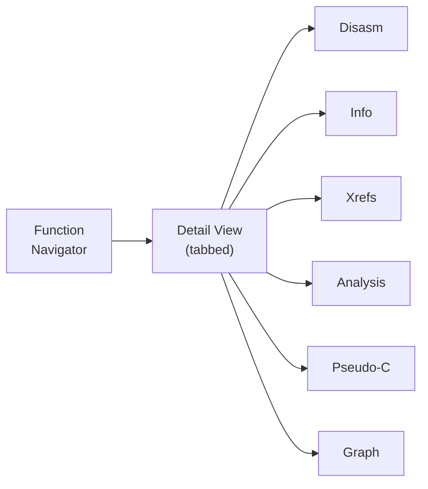

# The Interface

The interface is a single full-screen terminal layout: a one-line header bar at
the top, the function navigator on the left, a tabbed detail view on the right,
and a status line and footer at the bottom.

## Layout

## The header bar

A custom one-line bar holds a menu glyph (which opens the command palette), the
title, navigation controls, and a clock. The navigation controls give
browser-style back and forward over your jump history, plus quick pickers for
recent locations and functions with saved AI chats. See
[Keyboard Shortcuts](Keyboard-Shortcuts.md) for the jump-history keys.

## The function navigator

The left pane is a tree of functions grouped into two levels: first by kind
(Exports, Entry, Symbols, Subs, Imports, Other), then by a name prefix such as a
C++ class, a leading-underscore token, or an import's library. A filter box at
the bottom does subsequence matching, and a kind filter cycles through the
groups. The [Function Navigator](Function-Navigator.md) page covers it in full.

## The detail tabs

Selecting a function renders its detail in whichever tab is active. The tabs and
their default keys:

- **Disasm** (<kbd>d</kbd>): annotated disassembly with clickable operands.
- **Info**: container and function metadata.
- **Xrefs** (<kbd>x</kbd>): the wrapper chain, callers, and callees.
- **Analysis** (<kbd>a</kbd>): the [pattern detectors](Pattern-Detectors.md).
- **Pseudo-C** (<kbd>p</kbd>): a heuristic C-like rendering.
- **Graph** (<kbd>c</kbd>): a clickable call-graph navigator.

Moving the selection in the navigator updates the active tab, not just the
disassembly. Large functions are windowed around the current line so a single
huge view never stalls the interface.

## The welcome screen

`deglyph` with no binary opens on a welcome screen: the wordmark, a tagline, and a
list of recent sessions plus an option to open a file. Picking a recent session
restores its saved annotations and AI chats directly.

## Theming and glyphs

The interface ships a retro amber-on-brown palette by default and exposes a
theme switcher in the command palette; the chosen theme persists. Glyphs cascade
across three tiers: plain ASCII for limited terminals (`--ascii`), Nerd Font
icons when available (`--nerd`), and a safe Unicode default otherwise.

## See also

- [Function Navigator](Function-Navigator.md): grouping, filtering, and kinds.
- [Disassembly View](Disassembly.md): reading and navigating code.
- [Keyboard Shortcuts](Keyboard-Shortcuts.md): every binding.
- [Getting Started](Getting-Started.md): first steps.
